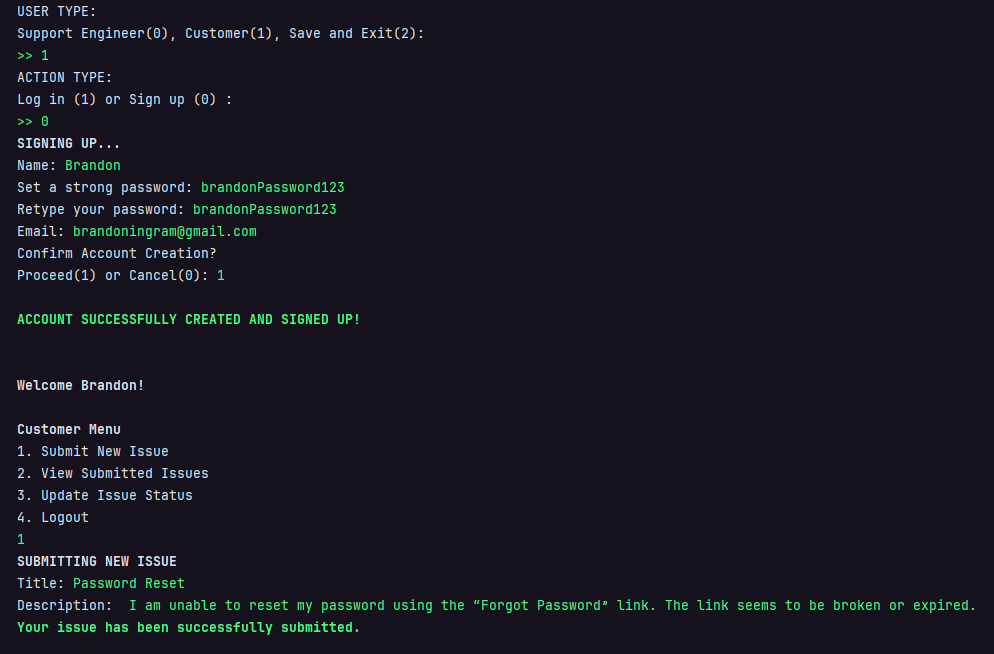
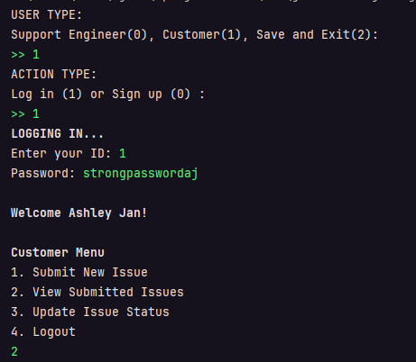
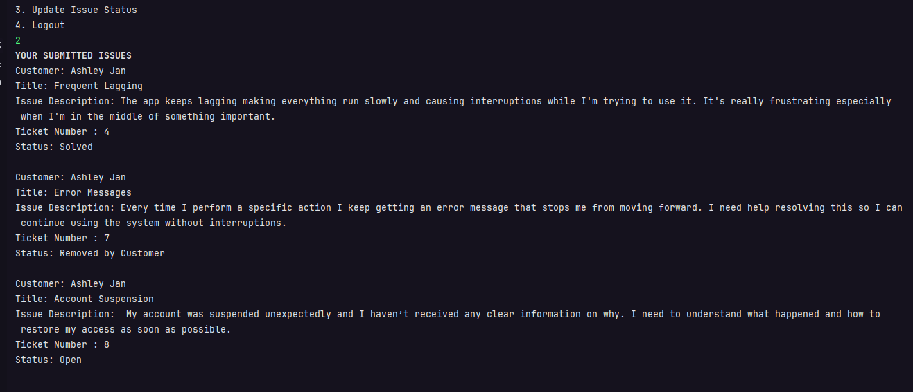
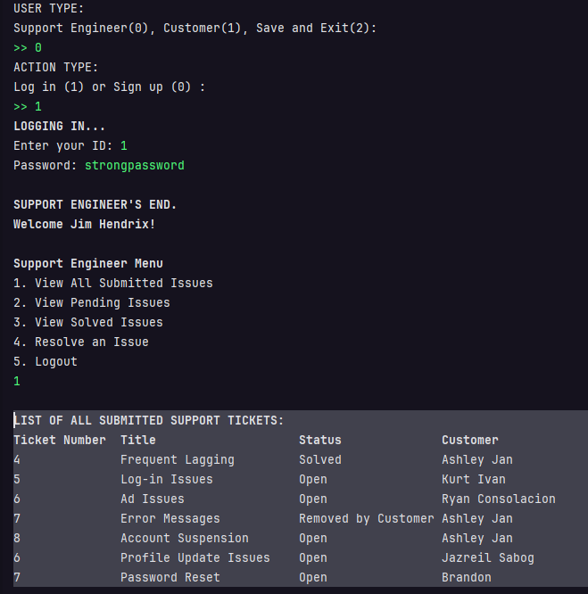
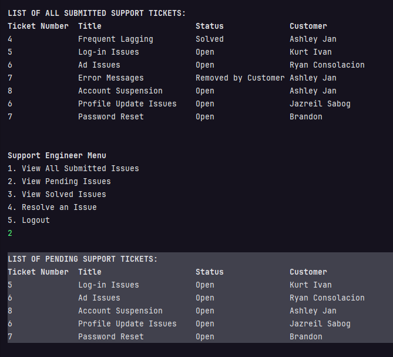
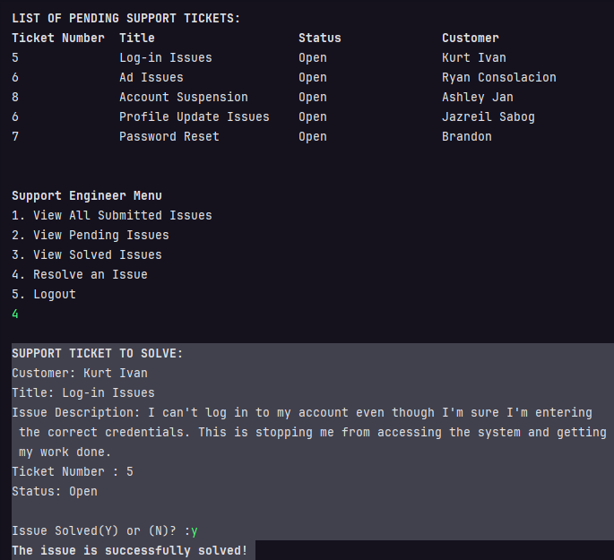
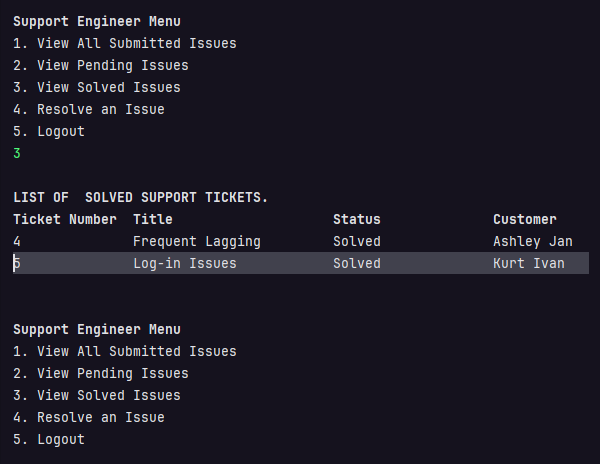

# Support Ticket Management System

## Sample Runs

### 1. Customer Account Creation and Ticket Submission

#### Customer 1—Brandon
- **Action:** Sign up and Submit Ticket
### Screenshot

#### Customer 1—Ashley
- **Action:** Log In and View Submitted Tickets
- Note that this account is made in the previous program runs.
### Screenshot

### 2. Support Engineer Actions

#### Engineer Login
- **Action:** View all submitted support tickets
- Note that some of the accounts here were made before running this program
- 

### View Pending Open Issues (Support Engineer)
- **It will show the support tickets with status `open`**

### Resolve an Issue (Support Engineer)
- **Here, the earliest submitted issue will be resolved first. So the first element which is `Log-In Issues` by `Kurt Ivan` should be resolved first. 

### View Solved Issues (Support Engineer)
- 
- **We can see that the issue by `Kurt Ivan` is solved. **

