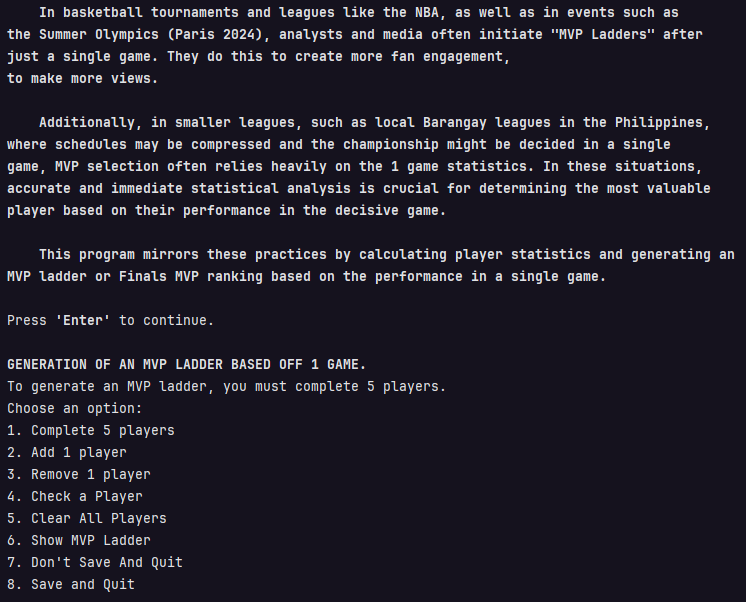
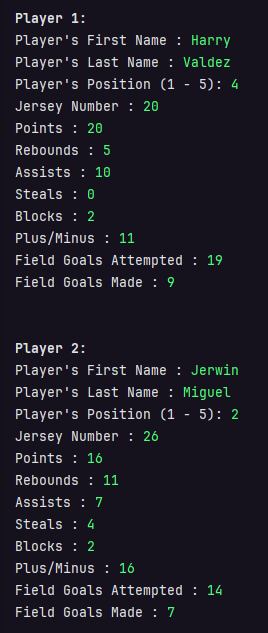
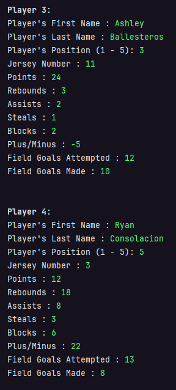
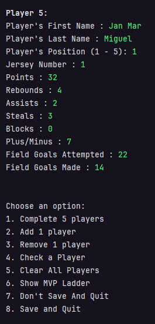
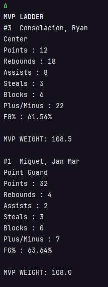
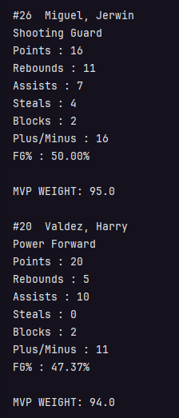
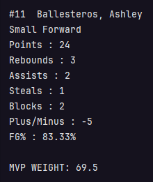
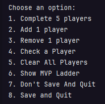

# MVP Ladder Simulation

This document outlines a simulation of the MVP Ladder program. The simulation demonstrates adding players, viewing player stats, showing the MVP ladder, deleting a player, and updating the MVP ladder.

## Simulation Steps

### 1. Complete 5 Players
Start by adding 5 players with their respective statistics:
1. **Player 1**:
    - Points: 20
    - Assists: 5
    - Rebounds: 10
    - otherImportantStats

2. **Player 2**:
    - Points: 26
    - Assists: 16
    - Rebounds: 11
    - other important stats

3. **Player 3**:
    - Points: 24
    - Assists: 3
    - Rebounds: 4
    - other important stats

4. **Player 4**:
    - Points: 12
    - Assists: 18
    - Rebounds: 8
    - other important stats

5. **Player 5**:
    - Points: 32
    - Assists: 4
    - Rebounds: 2
    - other important stats

### 2. Check MVP Standings based on metrics

- **It shows that the ranked 1 or the MVP based on stats is player `Ryan Consolacion` with an `MVP weight of 108.5`**

### 3. You can play along with other features like deletion, checking single player, and saving the file. 
