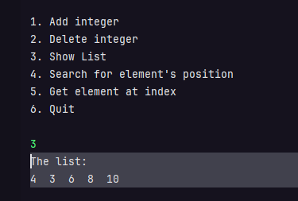
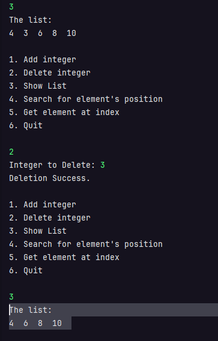

# Support Ticket Management System

## Sample Runs

### 1. Insertion of 5 elements and try to add 1 
- **5 is the max size of this fix-sized array**

- **Check that after inserting 5 elements, inserting another will be unsuccessful.**

### 2. Viewing of the elements 

### 3. Deleting 1 Element then View again

### 4. Searching for the element's position

### 5. Getting an element using an index
