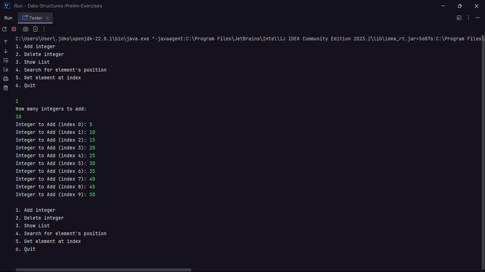
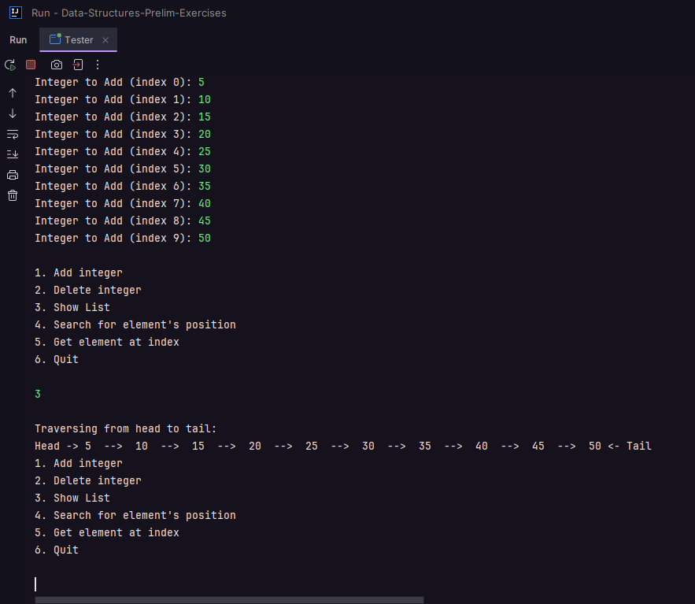
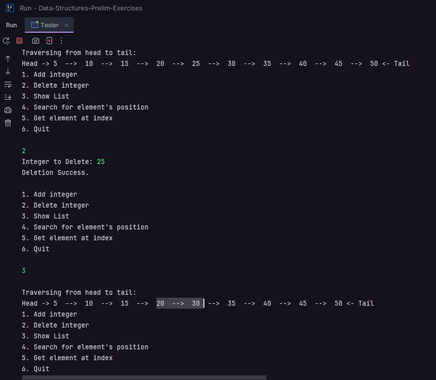
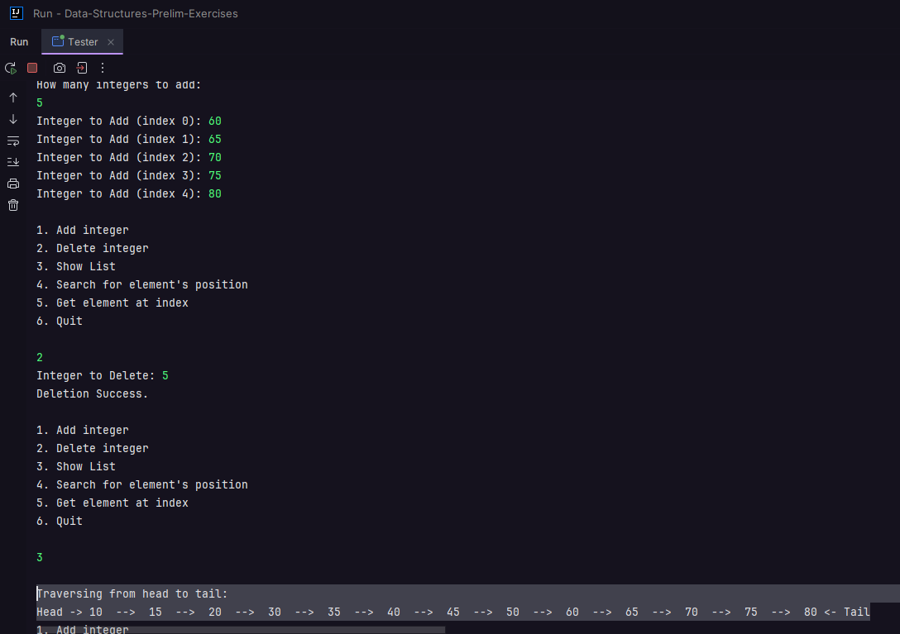
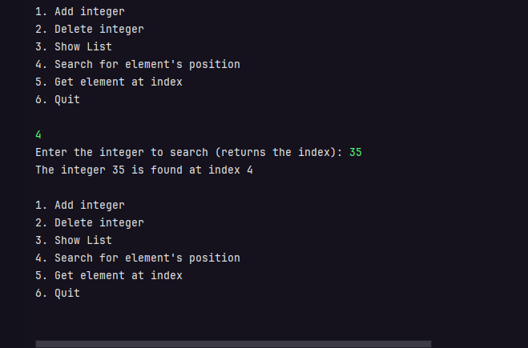
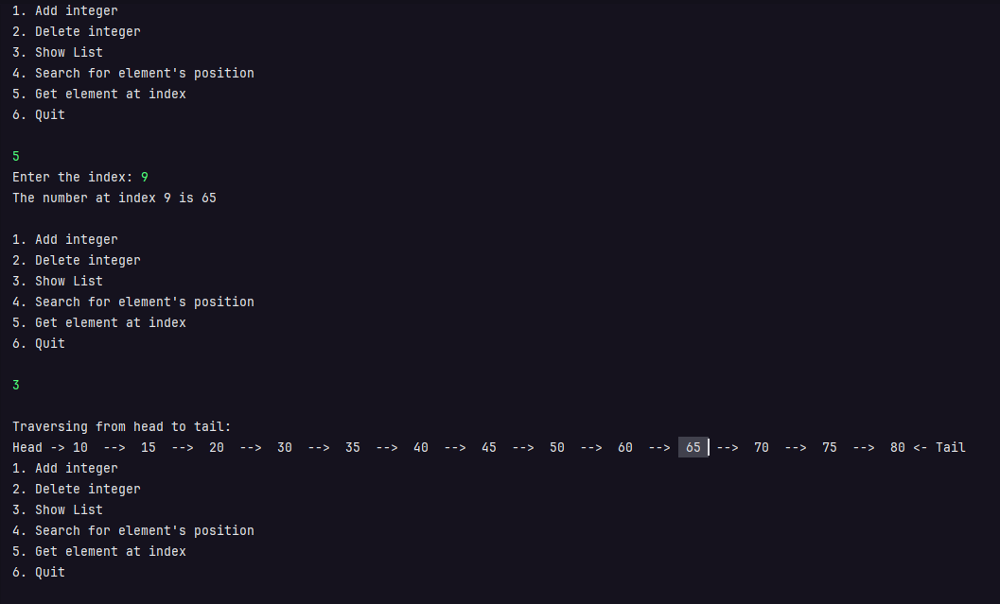

# Circular Linked List Tester Class - Screenshot Results

## 1. Initial Insertion of 10 Elements
After inserting 10 integers into the list, we can view the list by selecting option `3` (Show List).

### Input:
- Number of elements: 10
- Integers added: `5, 10, 15, 20, 25, 30, 35, 40, 45, 50`

### Insertion of 10 elements:
)
### Viewing of the list

### Description:
The list displays the elements in the order they were inserted. The traversal shows that the list is correctly connected from head to tail.

---

## 2. Deleting an Element and Viewing the List
After deleting an element from the list, we can view the list by selecting option `3` again.

### Input:
- Element to delete: `25`

### Deletion of element '25' and the List after the Deletion:

### Description:
The integer `25` was successfully removed from the list. The updated list no longer contains the element `25`, and the connections between the nodes remain intact.

---

## 3. Inserting More Elements, Deleting the First Element, and Viewing the List
After inserting more elements into the list, we will delete the first element which is 5,
after that we view the updated list.

### Input:
- Number of elements: 5
- Integers added: `60, 65, 70, 75, 80`

### Screenshot:
![Insert more elements](path_to_screenshot/insert_more_elements.png)

### Description:
Additional integers `60, 65, 70, 75, 80` were added to the list. Notice that the head is now pointing to the former second element which is 10, and 5 is gone.
The list now contains a total of 13 elements, and the traversal shows that all elements are linked correctly from head to tail.

---

## 4. Searching for an Element's Position
Next, we search for the position of an element within the list.

### Input:
- Element to search: `35`

### Screenshot:

### Description:
The search function successfully located the integer `35` in the list and returned its index which should be 4.

---

## 5. Getting Element at a Specific Index
Finally, we retrieve the element located at a specific index in the list.

### Input:
- Index to retrieve: `9`

### Screenshot:

### Description:
The integer located at index `9` in the list is `65`, as shown in the screenshot.
